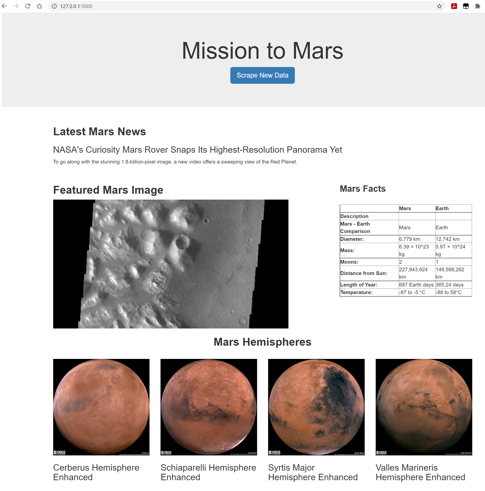

# Web-Scraping-Challenge
This is the 10th homework from my coding boot camp course.
This invovles 3 main components, first, need to know what and where to scrape, then we need to create a python file to let it run at the back and store all scraped information into a local database. The finaly part is a html page to showcase what we got.

## Key Reflects

### New Findings
1. Using beautifulsoup to scrape information from a webpage, it only work for the current url or file path, so if the process invovles a click over to a new page, then we need to redefine the path. And if there are few links within a page and we need to click them one by one, then a for loop is suggested to have browser.back() within the loop to iterate through the whole process.
2. When first renaming the scraped table information, I simply redefined it as df.columns = [['<col1>','<col2>',...]] and it failed when I set the index as one of the columns, given the error message:'TypeError: only integer scalar arrays can be converted to a scalar index'. So I used df.rename() and it all worked. 

### Uncertainties
1. I was trying to find a way to set a joined columns across few columns but with no luck. I was thinking maybe I could have multiple level of columns and then set the outer one as what I need and then just remove the inner columns.
2. I read about the splinter documentation where invovles mouse interactions. I firstly gone for the one called 'clicking links' for the 4 images part but it would not perform the action so I changed back to 'browser.links.find_by_partial_text()'. But I didn't find this one from the documentation!
3. When first run the app.py file, it shows a error message of 'jinja2.exceptions.UndefinedError: object has no attribute <atrribute name>'. As it refers to a specific key within my dictionary so I have spent a lot of time to debug it. And after I found the I missed "/" within the redirect(), it all worked. But the error message was not refering to this issue.

### Screenshot of Webpage

